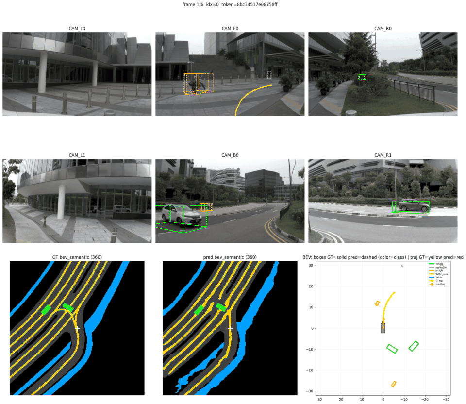

# Sparse-conv Offline Perception with Hydra-MDP Inference

Open Apache-2.0 stack for training, evaluating, and deploying an end-to-end
camera–LiDAR planner on [NAVSIM](https://github.com/autonomousvision/navsim).

A fused BEV feature \(\mathbf{F}_{\mathrm{env}}\) is shared by a Hydra-MDP-style
trajectory decoder and auxiliary 3D detection + BEV segmentation heads.
The LiDAR sparse-convolution (SCN) path runs on open
[`spconv`](https://github.com/traveller59/spconv) 2.x instead of NVIDIA
CUDA-BEVFusion’s closed `libspconv` binary.

| | |
|---|---|
| **License** | [Apache-2.0](LICENSE) · [NOTICE](NOTICE) |
| **Install + run (pth → Python → ONNX → TensorRT → C++)** | [`QUICKSTART.md`](QUICKSTART.md) |
| **Models (Google Drive)** | [`docs/MODELS.md`](docs/MODELS.md) |
| **Training / PDM eval** | [`docs/TRAINING.md`](docs/TRAINING.md) |
| **MLOSS write-up** | [`jmlr/`](jmlr/) |

<p align="center">
  
  <br/>
  <em>Inference demo on a mini scene (solid = GT, dashed = predicted).</em>
</p>

---

## Why this exists

NVIDIA’s [CUDA-BEVFusion](https://github.com/NVIDIA-AI-IOT/Lidar_AI_Solution) is a strong detection runtime, but:

1. the LiDAR SCN depends on a **non-redistributable** `libspconv`,
2. the reference exports **detection only** (no planning / BEV seg),
3. there is no documented NAVSIM train → eval → ONNX/TensorRT → C++ path.

This project fills that gap so you can train your own model, score it with
official NAVSIM PDM evaluation, and deploy with open SCN + TensorRT.

---

## Benchmarks

Results for checkpoint `gtrs_bevfusion_navtrain_v1_best.pth`.

### NAVSIM `navtest` (12,149 scenarios)

| Metric | Score |
|--------|------:|
| **PDM (overall)** | **0.7925** |
| No-at-fault collision (NC) | 0.982 |
| Drivable-area compliance (DAC) | 0.975 |
| Time-to-collision (TTC) | 0.981 |
| Ego progress (EP) | 0.854 |
| Driving-direction compliance | 0.996 |
| Traffic-light compliance | 0.998 |
| Lane keeping | 0.970 |
| History comfort | 0.964 |

### C++ FP16 latency (RTX 3060 12 GB)

| Module | ms |
|--------|---:|
| LiDAR (range-crop + open SCN) | 37.8 |
| Camera (LSS) | 169.8 |
| Fuser (\(\mathbf{F}_{\mathrm{env}}\)) | 1.6 |
| Heads (plan + det + seg) | 182.2 |
| **Total (device)** | **391.3** |

### Python ↔ C++ parity (token `8bc34517e08758ff`)

| Stage | Cosine | Max \|Δ\| |
|-------|-------:|----------:|
| Trajectory | 1.0000 | 0.0017 m |
| Agent boxes / class logits | 1.0000 | ~0.066 |
| BEV semantic logits | 0.9998 | 1.27 |
| \(\mathbf{F}_{\mathrm{env}}\) | 0.9971 | 0.73 |

---

## Clone and run

```bash
git clone https://github.com/atharvsharma1998/hydra-mdp.git
cd hydra-mdp
# stay on main → see QUICKSTART.md
```

| Smoke test | Data needed |
|------------|-------------|
| **Python** `.pth` viz | OpenScene-mini (logs + sensors + maps) |
| **C++** TensorRT | none — shipped `deploy/example-data/` (~11 MB) |

Full copy-paste sequence: **[`QUICKSTART.md`](QUICKSTART.md)**  
(`pth` → Python viz → ONNX → TensorRT → C++).

---

## Roadmap / TODO

- [x] Open SCN runtime (`spconv` 2.x) replacing closed `libspconv`
- [x] Multi-head ONNX export (planning + detection + BEV segmentation)
- [x] FP16 TensorRT engines + C++ deploy binary
- [x] One-frame `deploy/example-data/` for clone-and-run inference
- [x] NAVSIM `navtest` PDM evaluation (0.7925)
- [x] Python ↔ C++ stage parity
- [ ] **INT8 quantization** for TensorRT engines (latency / accuracy study)
- [ ] Faster eval path (trajectory cache + CPU-only PDM scoring)
- [ ] Ego-progress calibration (EP is the main soft spot at 0.854)
- [ ] Two-stage / navhard EPDMS evaluation
- [ ] Broader install testing (CUDA / TensorRT version matrix)

---

## Repository layout

```
navsim/agents/gtrs_bevfusion/   # PyTorch model, losses, features
scripts/training/               # train + viz
scripts/export/                 # ONNX export + parity compare
deploy/                         # C++/TensorRT + example-data/
docs/                           # models, training, SCN notes
QUICKSTART.md                   # pth → Python → ONNX → TRT → C++
jmlr/                           # short MLOSS software description
```

---

## Licensing

| Component | Status |
|-----------|--------|
| This repository | **Apache-2.0** |
| Open `spconv` SCN runtime | Open source |
| CUDA-BEVFusion camera / BEVPool template | NVIDIA Apache-2.0; closed `libspconv` **replaced** |
| CUDA + TensorRT 8.6 | Proprietary NVIDIA runtime (required for C++ path) |
| NAVSIM / nuPlan / OpenScene data | Separate licenses (only needed for train/full eval) |

See [`NOTICE`](NOTICE).

---

## Citation

```bibtex
@software{Sharma2026SparseConvHydraMDP,
  title  = {Sparse-conv Offline Perception with Hydra-{MDP} Inference},
  author = {Sharma, Atharv},
  year   = {2026},
  url    = {https://github.com/atharvsharma1998/hydra-mdp},
  note   = {Open-source camera--LiDAR planning stack for NAVSIM},
}
```

Based on the open [NAVSIM](https://github.com/autonomousvision/navsim) devkit
(Apache-2.0). Please also cite NAVSIM / Hydra-MDP / BEVFusion when using those pieces.

## Issues

[GitHub Issues](https://github.com/atharvsharma1998/hydra-mdp/issues) for bugs and questions.
